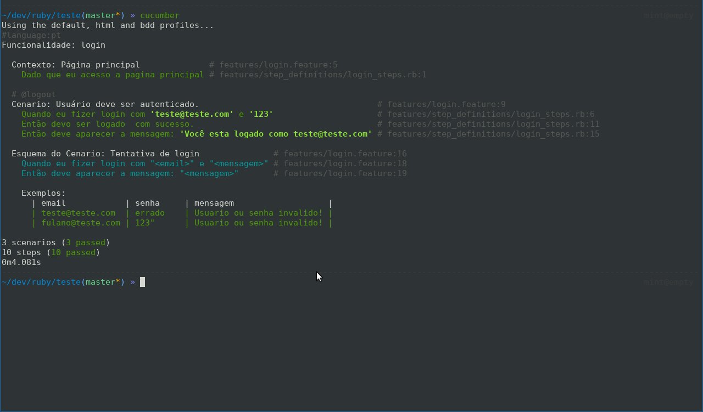

# BDD Teste de login Controle Estoque

---
Funcionalidade: login

    Contexto: Página principal
        Dado que eu acesso a pagina principal

    # @logout
    Cenario: Usuário deve ser autenticado.

        Quando eu fizer login com 'teste@teste.com' e '123'
        Então devo ser logado  com sucesso.
        Então deve aparecer a mensagem: 'Você esta logado como teste@teste.com'

    Esquema do Cenario: Tentativa de login
        
        Quando eu fizer login com "<email>" e "<mensagem>" 
        Então deve aparecer a mensagem: "<mensagem>"

    Exemplos:
    | email            | senha     | mensagem                   |
    | teste@teste.com  | errado    | Usuario ou senha invalido! |
    | fulano@teste.com | 123"      | Usuario ou senha invalido! |

---

&copy; 2020 regiefe@gmail.com

